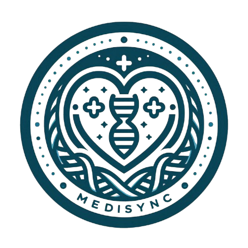

# MediSync - Patient Management System

MediSync is a comprehensive patient management system that helps healthcare providers manage patient data, track medicines, generate bills, and monitor IV fluid levels in real time. Built with a robust back-end using Node.js and MongoDB, and a dynamic front-end with HTML, CSS, and JavaScript, this project can integrate with IoT devices for fluid monitoring and can provide real-time updates for an improved healthcare experience.

## Table of Contents

- [Features](#features)
- [Tech Stack](#tech-stack)
- [Installation](#installation)
- [API Routes](#api-routes)
- [File Structure](#file-structure)
- [Admin Role](#admin-role)
- [Libraries Used](#libraries-used)
- [Screenshots/Demo](#screenshotsdemo)
- [Usage Examples](#usage-examples)
- [Challenges & Learnings](#challenges-learnings)
- [Project Architecture](#project-architecture)
- [Future Features](#future-features)

## Features

- **Patient Management**: Add, update, and delete patient information, including personal details, diagnosis, and medication.
- **Billing**: Generate and print patient bills with medicine charges, room charges, and more. The billing section is exportable as PDF.
- **Medicine Management**: Add and update medicines for each patient and dynamically manage them.
- **IV Fluid Monitoring**: Visualize IV fluid levels with interactive charts using Chart.js.
- **Admin Role**: Admins have exclusive access to add patients, manage medicines, and perform CRUD operations.

## Tech Stack

- **Frontend**: HTML, CSS, JavaScript, jQuery
- **Backend**: Node.js, Express.js
- **Database**: MongoDB
- **Libraries**: Chart.js (for IV fluid monitoring), jQuery (for AJAX and DOM manipulation), Boxicons (for UI enhancements), html2pdf.js (for PDF generation), Multer (for file upload)
- **Authentication & Authorization**: Custom admin check middleware

## Installation

### Prerequisites

- Node.js (>= 14.0)
- MongoDB instance (use MongoDB Atlas or a local MongoDB server)

### Steps to Run the Project Locally

1. Clone the repository:

   ```bash
   git clone https://github.com/nimish492/medisync.git
   ```

2. Navigate to the project directory:

   ```bash
   cd medisync
   ```

3. Install dependencies:

   ```bash
   npm install
   ```

4. Set up your MongoDB URI in the required `.env` file.

5. Start the server:

   ```bash
   npm start
   ```

6. The application will be accessible at `http://localhost:5000` in your browser.

## API Routes

- **GET /patients**: Fetch all patients.
- **POST /patients**: Add a new patient (admin only, image upload supported).
- **DELETE /patients/:id**: Delete a specific patient (admin only).
- **PATCH /patients/:id**: Update patient details.
- **GET /search-patients?q={query}**: Search patients by name.
- **PUT /patients/:id/medicines**: Update patient’s medicines (admin only).

## File Structure

```
/medisync
  /middleware          - Admin role checks
  /models              - MongoDB models (e.g., Patient)
  /public
    /assets            - Static assets like images and CSS
    /html              - HTML files
    /css               - CSS files
    /script            - JavaScript files
  /routes              - API routes for patient management, billing, and medicines
  package.json         - Project dependencies
  server.js            - Main server file
```

## Admin Role

- Admin users have access to manage patient records, billing, and medicines. Regular users can view patient details but cannot perform administrative tasks.

## Libraries Used

- **Multer**: For handling file uploads (patient images).
- **Chart.js**: For visualizing IV fluid monitoring data.
- **html2pdf.js**: For generating PDF bills.
- **Boxicons**: For UI iconography.
- **jQuery**: For AJAX requests and DOM manipulation.

## Screenshots/Demo


_Dashboard showing patient details and IV fluid monitoring._

_You can also explore the demo here: [Live Demo](https://medisync-69xx.onrender.com/)_ 
_Find Out Credentials [here](https://docs.google.com/document/d/1KG0wNcd6NASyJgpRG2vS0gN5xddWxgZlh3Ih0yoyzg8/edit?usp=drive_link)_

## Usage Examples

### Add a New Patient

```bash
POST /patients
{
  "name": "John Doe",
  "age": 45,
  "symptoms": "Cough, Fever",
  "diagnosis": "Flu",
  "physician": "Dr. Smith"
}
```

### Update Patient’s Medicines

```bash
PUT /patients/12345/medicines
{
  "medicines": ["Paracetamol", "Ibuprofen"]
}
```

### Generate a Bill for a Patient

```bash
GET /patients/12345/bill
```

## Challenges & Learnings

- **Handling File Uploads**: Initially, dealing with patient image uploads was tricky, but Multer helped manage file storage effectively.
- **Admin Role Management**: Ensuring proper admin access control and preventing unauthorized access was crucial for the project’s security.

## Project Architecture

- The project follows a **Model-View-Controller (MVC)** architecture:

  - **Model**: Defines the data structure using Mongoose (Patient, Medicine).
  - **View**: HTML, CSS, and JavaScript files render the user interface.
  - **Controller**: Express routes handle the API logic for patient data management, billing, and IV fluid monitoring.

- **Frontend** communicates with the **Backend** via RESTful API endpoints, utilizing AJAX for dynamic, real-time updates.

## Future Features

- **Alarm System**: Implement an alert system to notify when IV fluid levels are critically low.
- **Patient History**: Track patient history for diagnosis, medicines, and treatment.

---

### Contributions

Feel free to fork and contribute to the project. If you have any questions, please open an issue, and I’ll be happy to help.
